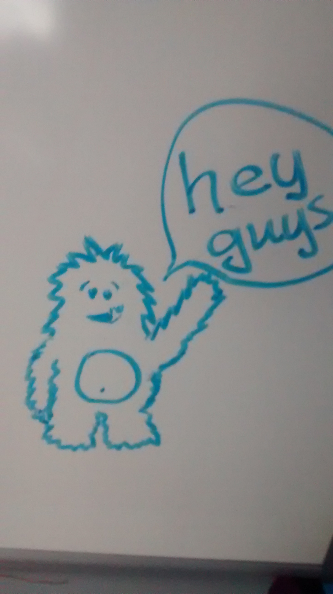
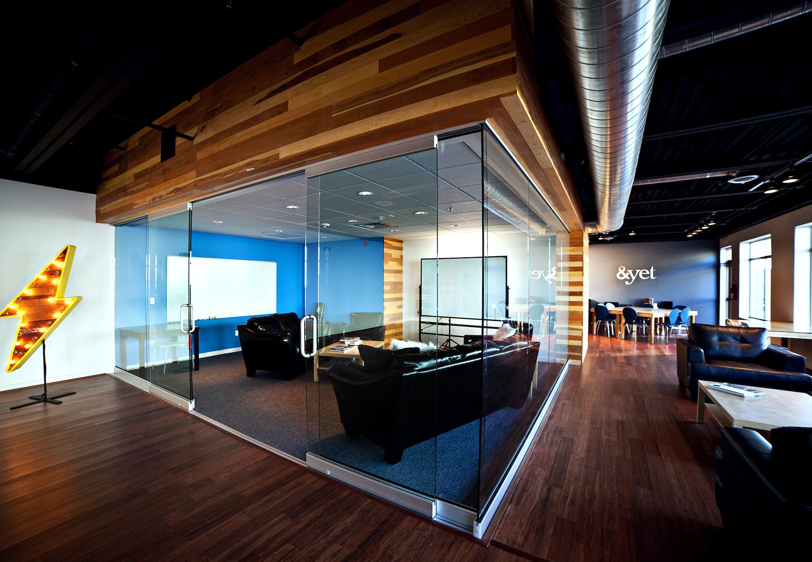
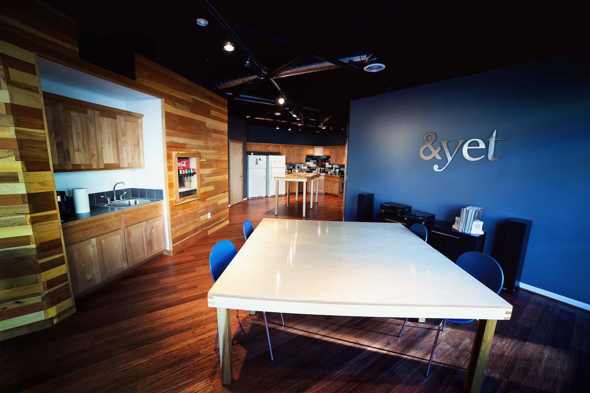
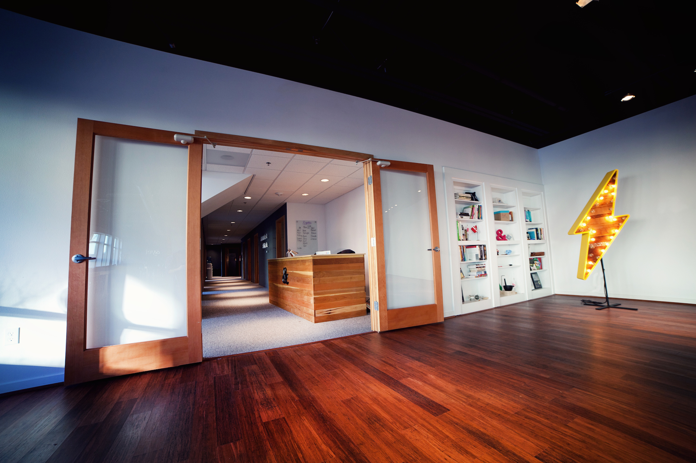
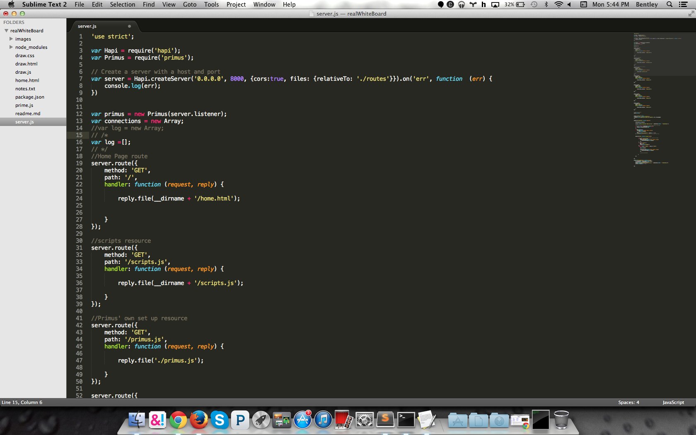
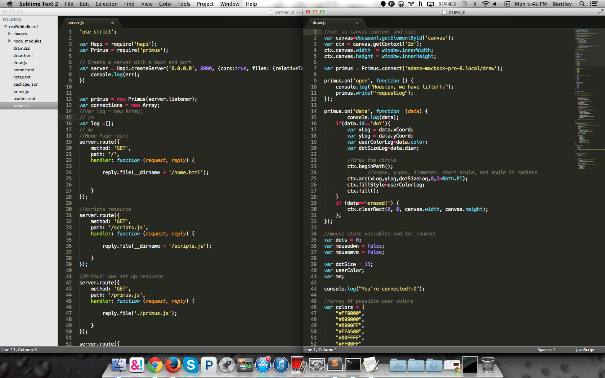
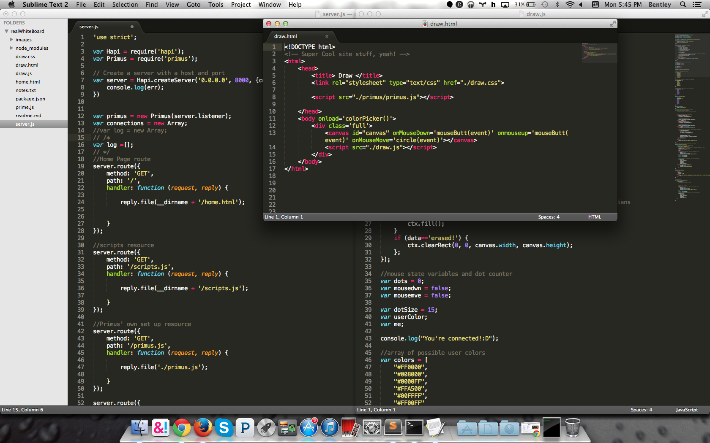
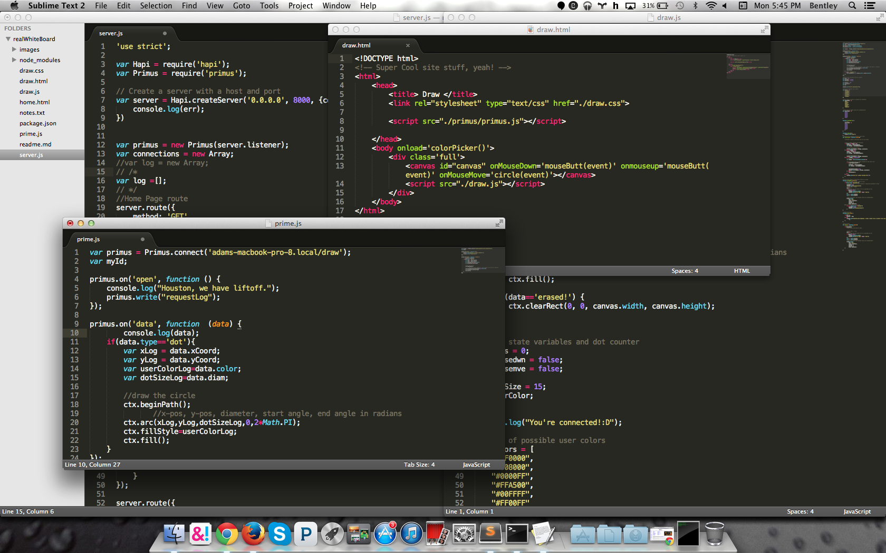
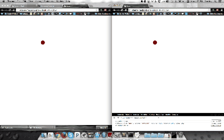

<!--- ## &amp;yet Style -->
# This  {.class="fragment"}
#Internship
# Thing  {.class="fragment"}

Bentley Jensen

---

#&amp;yet
 {.class="fragment"}

---

#My Qualifications
 * Taking MultiMedia Atrs: Web Design and Computer Science I {.class="fragment"}
 * **_My interest_** {.class="fragment"}

---

#My "Interview" {.class="fragment"}
- Prepared to interview a lot of places {.class="fragment"}
- Didn't think I was good enough to get into this one {.class="fragment"}
- They didn't even really have an internship at first {.class="fragment"}

---

## The Office

---

<!-- slide-attributes: data-transition=none -->

---

<!-- slide-attributes: data-transition=none -->

---

<!-- slide-attributes: data-transition=none -->

---

<!-- slide-attributes: data-transition=none -->

---

<!-- slide-attributes: data-transition=none -->

---

#What I do {.class="fragment"}

<pre class="fragment" width="80" height="50"><code class="javascript" width="100" height="100">
var canvas=document.getElementById('canvas');
var ctx = canvas.getContext('2d');
ctx.canvas.width  = window.innerWidth;
ctx.canvas.height = window.innerHeight;

var primus = Primus.connect('laptop.local/draw');

primus.on('open', function () {
    console.log("Connection is Open.");
    primus.write("requestLog");
});

primus.on('data', function  (data) {
        console.log(data);
    if(data.id=='dot'){
        var xLog = data.xCoord;
        var yLog = data.yCoord;
        var userColorLog=data.color;
        var dotSizeLog=data.diam;
        
        //draw the circle 
        ctx.beginPath();
               //x-pos, y-pos, diameter, start angle, end angle in radians
        ctx.arc(xLog,yLog,dotSizeLog,0,2*Math.PI);
        ctx.fillStyle=userColorLog;
        ctx.fill();
    }
    if (data=='erased!') {
        ctx.clearRect(0, 0, canvas.width, canvas.height);
    };
});
</code></pre>

---

#My Project
- Backend {.class="fragment"}
- Clientside {.class="fragment"}
- Magic Inbetween {.class="fragment"}

---

#To Make {.class="fragment"}
#A Whiteboard!{.class="fragment"}

---

#PSH!  {.class="fragment"}
##_Easy._  {.class="fragment"}

<section data-transition="none">

</section>

---

{.data-transition="fast"}

---

{.data-transition="none"}

---

{.data-transition="none"}

---

{.stretch="true"}

---

#Connecting Course
* MMA Web Design{.class="fragment"}
	* HTML{.class="fragment"}
* Comp Sci I{.class="fragment"}
	* Basic Prgramming Logic{.class="fragment"}

---

---

# Big **Title** Slide {.class="big"}

> This is a blockqoute!  
> Line 2  
> <small class="fragment">Luke?</small>

---

<!-- slide-attributes: data-background="#000" data-state="hide-all-controls"  -->
# The End ?

---

<!-- slide-attributes: data-background="#000" data-state="hide-all-controls" -->
# &nbsp;
